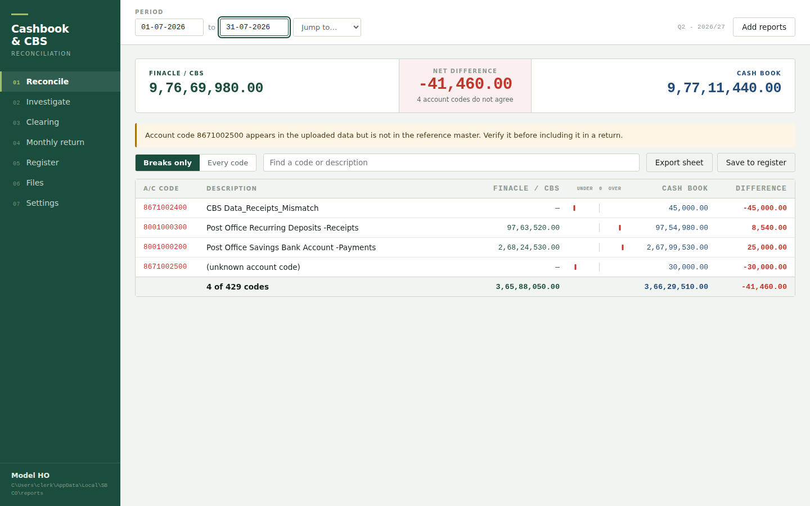
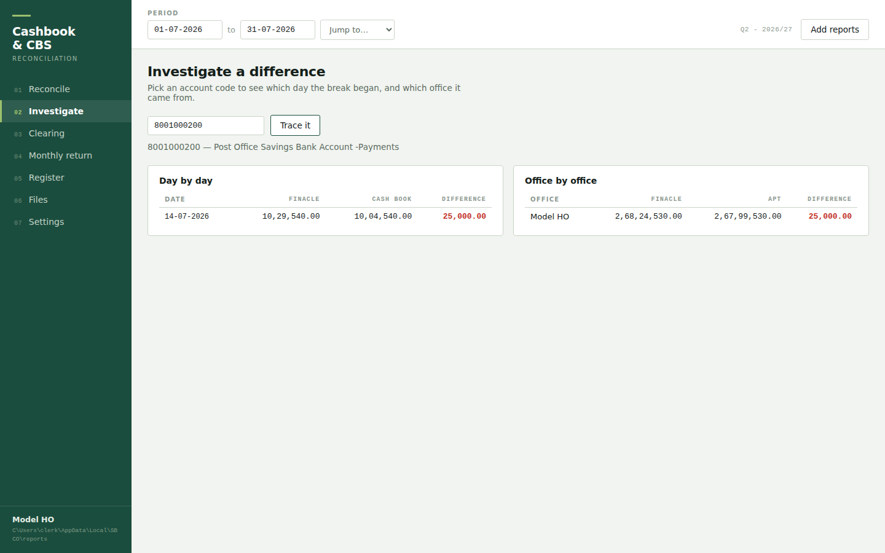
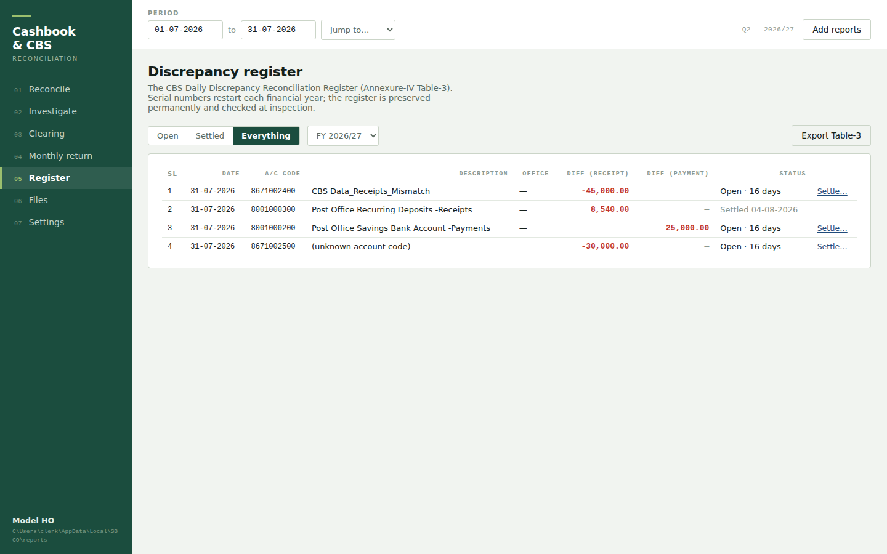
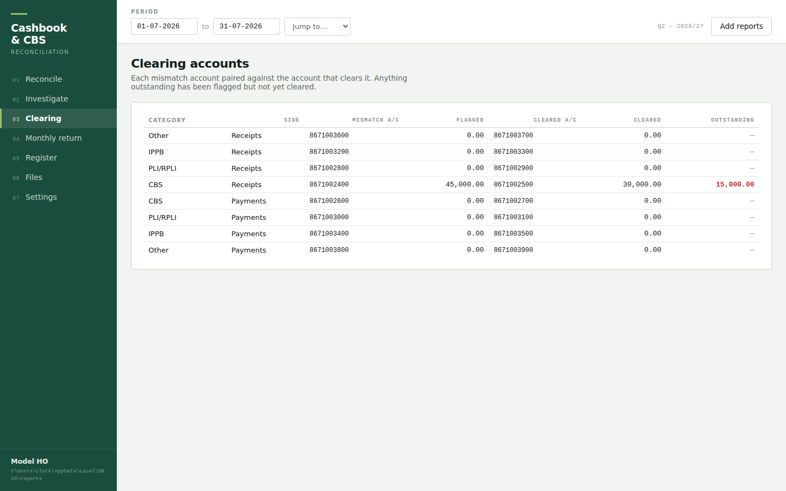
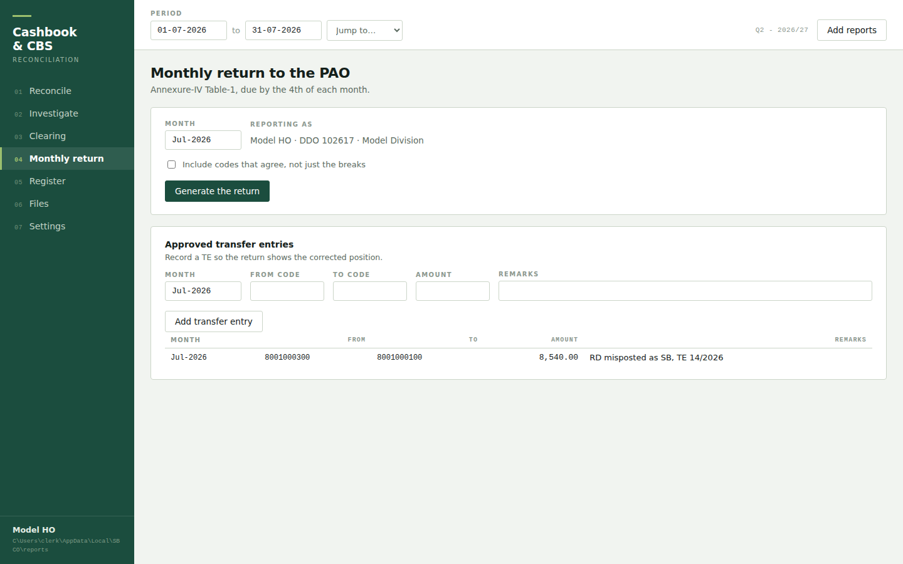

# SBCO Reconciliation

**Cashbook–CBS reconciliation for India Post Head Offices**, implementing
SB Order No. 09/2026 end to end: import the Finacle/CBS and APT 2.0 reports,
reconcile them daily, trace every break to the day and office it came from,
maintain the statutory Discrepancy Register, and produce the monthly
Annexure-IV return to the PAO.

[](https://github.com/rahulranjan-dev-py/SBCO-RECONCILIATION/actions/workflows/windows.yml)


[](LICENSE)



It runs as a local web app on the clerk's own PC — bound to 127.0.0.1, no
account system, no telemetry, no outbound connection — and everything the
interface does is also a CLI command, so runs can be scripted. It is a ground-up
rebuild of the community Excel/VBA `CASHBOOK_TOOL_for_SBCO` workbook: same job,
with the defects found in the review of the original designed out rather than
patched (see the table below).

## The screens

| | |
|---|---|
|  **Investigate** — pick a code, see the day the break began and the office it came from |  **Register** — the statutory Table-3 register: FY-wise serials, ageing, settlement |
|  **Clearing** — the eight mismatch heads paired against their clearing accounts |  **Monthly return** — Annexure-IV Table-1 with the DDO's approved transfer entries |

New to the tool? Start with the **[User guide](docs/USER_GUIDE.md)** — the
daily and monthly routine in plain language. The version history is in the
**[Changelog](CHANGELOG.md)**.

## Install

**End users on Windows** do not install anything: each release ships
`SBCO-Reconciliation-<version>-windows-x64.zip`. Extract it anywhere -
Desktop, Documents, a shared drive - and double-click
**SBCO Reconciliation** (the application) inside. No administrator rights, no
Python on the PC, nothing added to PATH; the folder carries its own runtime
(python.org's embeddable CPython, renamed but unmodified, its PSF signature
intact). The signed interpreter itself is the entry point precisely because
managed Windows (Smart App Control, SmartScreen) blocks downloaded *scripts*
outright but allows reputably signed executables. Upgrading is replacing the
folder - the data lives in `%LOCALAPPDATA%\SBCO`, so it survives. See
`packaging/README.md` for the full design rationale.

**From source** (any OS):

```bash
python -m pip install -e ".[dev,xls]"
python -m sbco_recon.cli doctor      # checks the whole environment
```

Python 3.9+. `openpyxl` is the only hard dependency; `xlrd` is optional and only
needed for legacy BIFF `.xls` downloads.

On Windows, python.org now ships the **Python Install Manager** rather than the
old installer, and there is no "Add python.exe to PATH" checkbox. If `python`
is not recognised, run `py install --configure` and enable the *Python
(default)* and *Python install manager* app execution aliases, then open a new
terminal. `doctor` detects this and says so.

pip usually places `sbco.exe` outside PATH, so `python -m sbco_recon.cli` is the
reliable form of every command below; `Start SBCO Reconciliation.bat` handles it
for end users.

## Use

Double-click **Start SBCO Reconciliation.bat**. The tool opens in your browser:
seven screens — Reconcile, Investigate, Clearing, Monthly return, Register,
Files, Settings. Drag report files onto **Add reports**; the tool identifies
each one itself.

The interface is a local web app served by the Python standard library, bound to
127.0.0.1 only. No account system, no telemetry, no outbound connection.

Everything the interface does is also a command, for scripted runs:

```bash
sbco gui                                    # open the interface
sbco doctor                                 # check this PC is set up
sbco config --ddo 102617 --ho "Manipal HO" --division Manipal
sbco load offices.csv                       # office master, once
sbco load cashbook_jul.xls finacle_jul.xls  # any number of files
sbco reconcile --month Jul-2026
sbco datewise 8001000200 --month Jul-2026   # find the day a break began
sbco officewise 8001000100 --month Jul-2026
sbco clearing --month Jul-2026
sbco annexure --month Jul-2026              # writes CBS-MRR-TABLE1-Jul-26.xlsx
sbco register --record --month Jul-2026     # save the month's breaks to Table-3
sbco register --settle 4 --date 02-08-2026 --misc "Misc txn 12/2026"
sbco register --export                      # the FY's register as Table-3 .xlsx
sbco batches                                # what has been loaded
sbco reverse 3                              # undo exactly one upload
```

## What changed, and why

| Legacy behaviour | Now |
|---|---|
| Password `"suraj"` in 206 places; sheet protection as the security model | No protection theatre. Data lives in SQLite; the file is the artefact, not the fortress |
| 38 routines disabled calculation with no error handler - a crash left manual calc and stale figures on screen | No global Excel state to corrupt. A failure aborts its own transaction and nothing else |
| Batch upload reported 3 selected, 2 processed, 0 failed | Every submitted path yields exactly one `FileOutcome`; the runner asserts the count before reporting |
| Uploading the same file twice double-counted it | SHA-256 per file; a repeat is reported as `duplicate` |
| Deleting a date range removed correct data sharing those dates | `reverse` removes exactly one batch's rows |
| One cell (`L2 = "Progressive Total"`) decided validity | Header-driven detection anywhere in the first 40 rows; survives inserted columns; every rejection names its reason |
| Quarter table hardcoded to 31-Mar-2029 | Computed; works for any date |
| Required Windows set to English (India) | Locale-independent parsing; day-first only, never guesses |
| Amounts as floats | `Decimal` throughout - exact zero comparisons |
| Missing day looked identical to a real difference | Coverage check warns before figures are shown |
| 19,110 volatile `OFFSET` calls | Two indexed queries and a dict merge |
| Up to 99.3% duplication between procedures | One parameterised path per operation |
| `Option Explicit` in 1 of 30 modules | Typed dataclasses; `Entry` rejects a float amount at construction |

## Layout

```
src/sbco_recon/
  fiscal.py       Indian FY quarters and periods (replaces the VALIDATOR sheet)
  normalize.py    locale-independent date / amount / code parsing
  model.py        typed records; Entry is immutable and Decimal-only
  store.py        SQLite store - atomic batches, dedupe, reversal, audit trail
  reconcile.py    the engine: by code, by office, by date, clearing accounts
  ingest/
    reader.py     .xls / .xlsx / .xlsb / .csv, plus HTML tables wearing .xls
    detect.py     header-driven report identification
    glwise_form.py  the raw Finacle GL-wise export (form-style header, per-SOL
                    sections, Deposits/Withdrawals split) - see below
    parse.py      rows -> Entry, with per-reason skip accounting
    batch.py      the loader that cannot lose a file
  reports/        Annexure-IV Table-1 and general .xlsx exports
  webapp/         local server + the browser interface (no build step, no CDN)
  refdata/        3,006 account codes, 428 dashboard codes, 8 clearing pairs
                  recovered from the original workbook
packaging/        builds the portable Windows zip (embeddable runtime, no
                  installer); CI smoke-tests the bundled runtime end to end
tests/            regression suites pinning the legacy defects and QA findings
```

## Supported upload formats

| Extension | Read via | Notes |
|---|---|---|
| `.xlsx` `.xlsm` | openpyxl | |
| `.xls` (true BIFF) | xlrd | needs the `[xls]` extra |
| `.xls` (really xlsx) | openpyxl | detected by content, not extension |
| `.xls` (really HTML) | built-in parser | what several portals actually emit |
| `.xlsb` | pyxlsb | |
| `.csv` `.tsv` `.txt` | csv | delimiter sniffed: comma, tab, semicolon, pipe |

The extension is a hint, not the decision — every `.xls` is sniffed by magic
bytes first, because portal exports are frequently something else wearing an
`.xls` name. PDF is not supported: the reports must be downloaded in Excel
format, not PDF.

Two shapes of the Finacle GL-wise report are understood. The columnar shape
carries a date and SOL ID on every row. The raw export as Finacle actually
emits it (SB Order 09/2026 Annexure-III) is a *form*: the date and SOL sit in
a label/value header block and the amount is split into Deposits (Cr) /
Withdrawals (Dr) — and a Set-ID report repeats the block once per SOL. Both
are detected automatically; the form's header date and each section's SOL are
stamped onto every row, so a single Set-ID upload also feeds the office-wise
reconciliation.

## Annexure-IV, SB Order No. 09/2026

All three prescribed forms are implemented to the order's own layout:

| Form | What it is | Cadence |
|---|---|---|
| Table-1 | CBS Monthly Reconciliation Report to PAO | by the 4th monthly |
| Table-2 | Detailed report: opening / current / rectified / pending | by the 4th monthly |
| Table-3 | CBS Daily Discrepancy Reconciliation Register | daily, kept permanently |

Every money column is split into Receipts and Payments. Para 1(ix) of the order
forbids netting a receipt discrepancy against a payment one, so a single signed
figure per account code would do the thing the order prohibits. Which side a
figure lands on comes from the account code itself, via the `ac_codes` master —
not from the sign of the difference.

Monthly Cash Account is defined by the order as daily cash books plus approved
transfer entries of the DDO, so TEs are folded into that column. A transfer
entry posts both legs: the from-code down, the to-code up.

Table-3 is a maintained register, not just an export. **Save to register** on
the Reconcile screen records the period's breaks (recomputed server-side, one
open entry per code per date — pressing it twice cannot double-enter); the
Register screen lists each financial year with serials that restart from 1
every April, and settles an entry only when the rectification is recorded —
the Misc. transaction posted, the transfer entry, or both, with the date of
rectification. The export writes the order's own (a)–(o) layout with the
difference columns as live formulas.

## Reference data

Recovered from the original workbook so the rebuild starts with real master
data: the full account-code master with HOA, receipt/payment side, sign and
Part; the 428-code dashboard ordering; and the eight clearing-account
mismatch/cleared pairs (CBS, PLI/RPLI, IPPB, Other x Receipts/Payments).

## Tests

```bash
pytest -q        # 137 passed
pytest -q -O     # also passes with assertions stripped
```

Two regression suites. `test_engine.py` pins the legacy defects shut (F-04 file
accounting, F-11 validation, F-13 quarter expiry, F-24 locale dependence).
`test_qa_regressions.py` pins the QA findings shut, including an HTTP-level
suite that re-runs the original attacks (cross-origin POST, foreign Host
header, database download) and a property test asserting that shuffling the
column order of a report never changes the parsed totals.

## Data location

The database lives in your user data folder, never in the program directory, so
re-extracting the archive to upgrade cannot touch it. Override with
`SBCO_DATA_DIR`, or `--db` for a specific file. Generated reports go to a
`reports` subfolder beside it.

## Status

Engine, ingest, store, reconciliation, reports and the browser interface are
complete and tested. The interface and the CLI call the same engine functions,
so both give identical figures.
